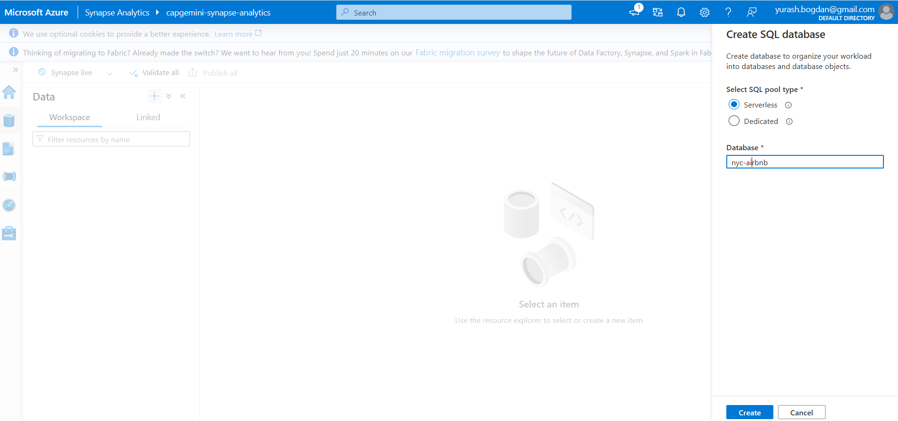
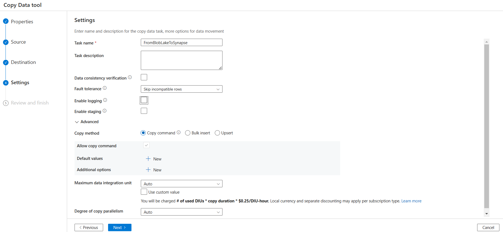
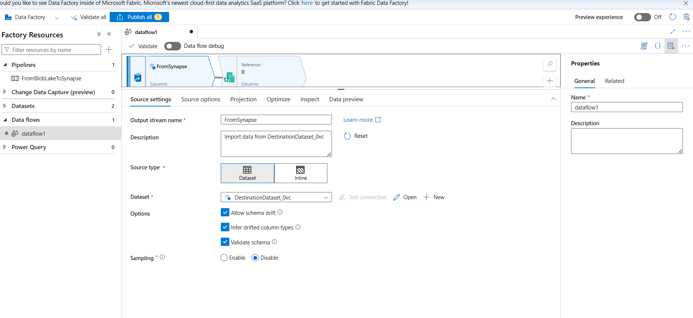

# Azure practical task

Here the instruction how to complete this rask

## 1. Create necessary resources

### Blob Storage

First we need to create Blob Storage

Explanation:

| **Field**            | **Explanation**                                                                                        |
|----------------------|--------------------------------------------------------------------------------------------------------|
| **Region**           | In this case i used recommended region. For best efficiency use close to the client                    |
| **Primary service**  | In this case i used Data Lake Storage for best efficiency and to work with Azure Synapse Analytics     |
| **Primary workload** | Big Data Analytics for hot storage and low latency read. Also suitable HPC in case of parallel process |
| **Performance**      | Standard for general purpose and lower cost                                                            |
| **Redundancy**       | If we want to store raw data we can just save our data locally without copies as in GRS                |

The following settings depend on different usage scenarios. For example, it is advisable to disable Public access from
all
networks for user sensitive data. In the Data protection section, also set soft delete to return data depending on the
data type.
data, and enable versioning. In this case, I left the default settings. Best practice also says to add
tags for better understanding the purpose of storage

### Data Factory

Creation is also very simple. You can also make DF with default settings. But add previous resources group and same
region as Blob Storage.

### Synapse Analytics

To create Azure Synapse Analytics you need

1. to have Pay as you go subscription, because free trial 200$ subscription is
   not allow to use this service.
2. Also create container and directory in your storage account created previously and than select necessary container
   here
   
3. In security tab create login and password to resource. Additionally, you can add encryption
   
4. Additionally you can specify network policy or save default

## 2. Setting Synapse Analytics

1. Go to workspace
2. Create new serverless DB
   

## 3. Create pipline in Data Factory

On this step we need to implement loading raw data from Blob Storage to Synapse Analytics

1. Go to Data Factory workspace
2. Click on **Ingest** button
3. In new window select Built-in copy task with schedule on specific time and recurrence
   
4. In new source windows you need to create new connection to your storage
   
5. After creating you need to specify file names that will be stored in storage. To implement ingestion only new files
   you need to store files with name of data. In this case i decided to have files in format {yyyy}_{month}. Below you
   can see example of this. Generated file format is shown in window. You need to upload same file with same name to
   storage
   
6. Setting file format and separators
   
7. Get serverless endpoint of ASA
   
8. Setting destination with ASA. Alter copied utl, password and login of ASA when created and database name
   
9. create raw table

## 4. Create data flow with filtering
1. In ADF click to create new transform flow
2. Firstly add resource from Synapse

3. After that parse all columns to valid type. Convert to int, decimal or date without null values

4. Filter data

5. Load to transformed table of Synapse

6. After that connect piplines

